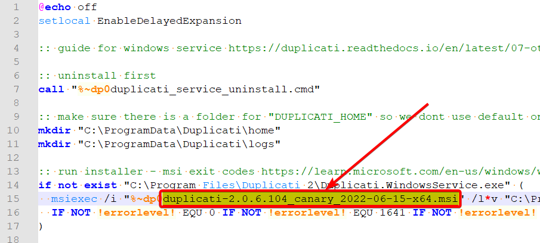

### Steps to install Duplicati as Windows Service
1. Download files from this repository to somewhere on the disk

2. Download latest Windows x64 canary release into same folder from https://github.com/duplicati/duplicati/releases or use some older version from https://www.duplicati.com/download

3. Edit duplicati_service_install.cmd to match latest x64 msi installer from step 2 with notepad or similar tool

You might also change default options at server startup - check line 26.

4. Run `duplicati_service_install.cmd` as administrator

5. Open Duplicati GUI Trayicon from start menu and configure your backups - see docs at https://duplicati.readthedocs.io/en/latest/03-using-the-graphical-user-interface/

### Why installing as a service on Windows?
One reason is when needed to backup files that are in use while backing up (like MS Outlook PST files) then you must use VSS (volume shadow copy https://forum.duplicati.com/t/volume-shadow-copy-for-open-locked-files/10520, --snapshot-policy config) and that means running Duplicati with administrative/elevated rights.

### More information
Duplicati forum discussion about installing as Windows service
https://forum.duplicati.com/t/install-as-windows-service/10114

Another discussion about improvement posibilities in Wdinwos server deployment https://forum.duplicati.com/t/duplicati-as-a-service-more-complicate-than-it-need-be/12278
